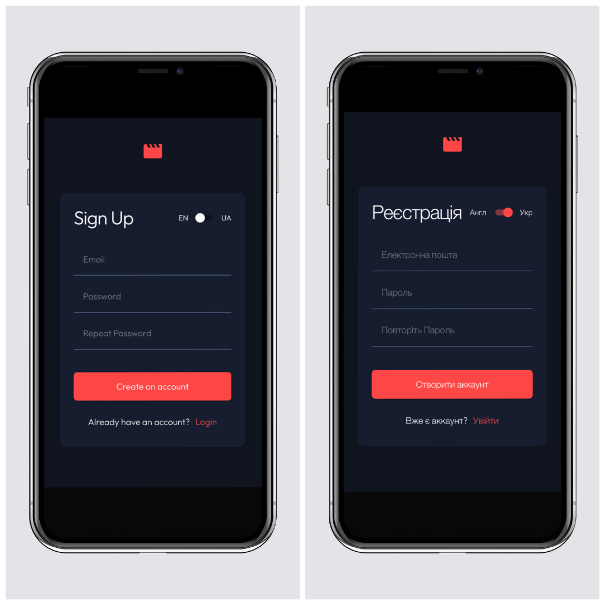
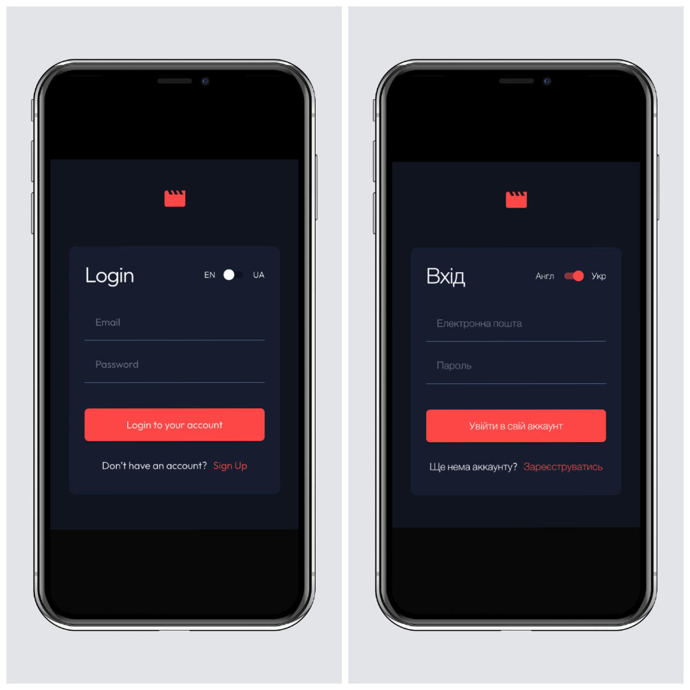
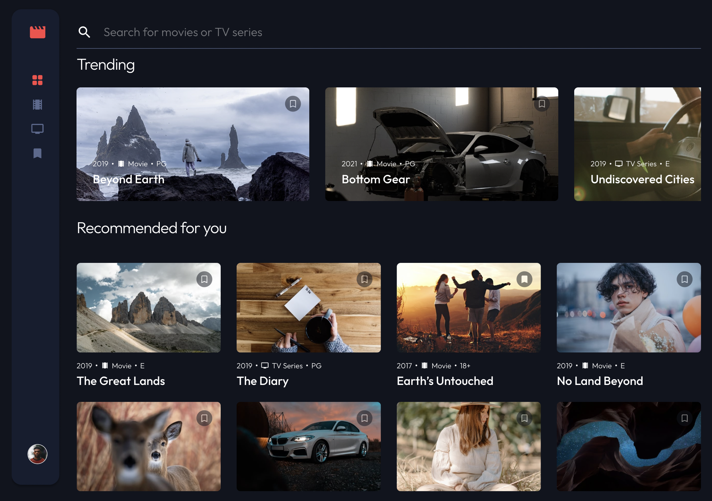
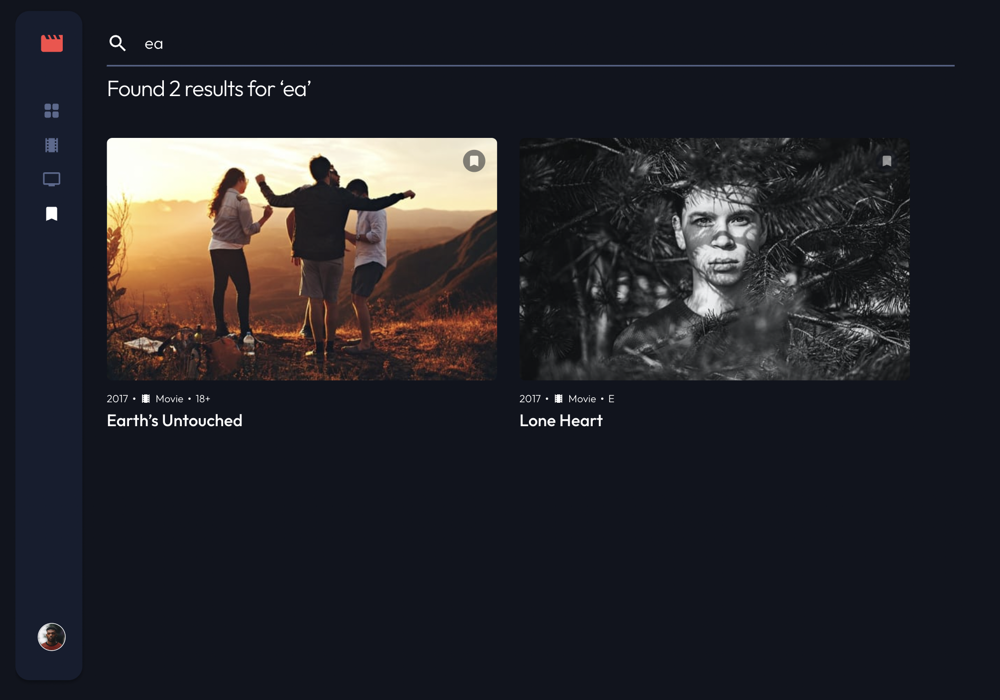
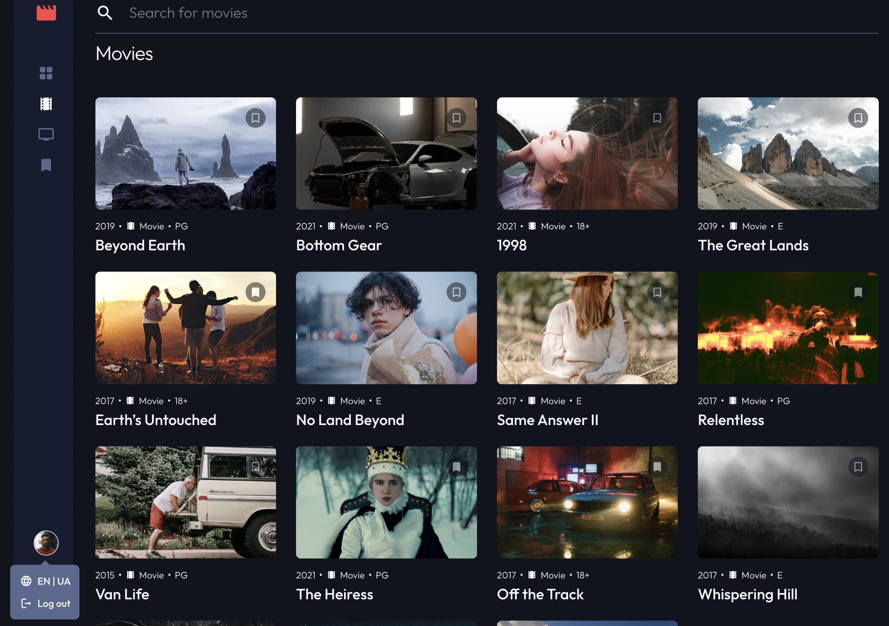

# Frontend Mentor - Entertainment web app solution

This is a solution to the
[Entertainment web app challenge on Frontend Mentor](https://www.frontendmentor.io/challenges/entertainment-web-app-J-UhgAW1X).
Frontend Mentor challenges help you improve your coding skills by building
realistic project.

## Table of contents

- [Overview](#overview)
  - [The challenge](#the-challenge)
  - [Screenshot](#screenshot)
  - [Links](#links)
- [Built with](#built-with)
- [Installation](#installation)
- [Author](#author)
- [Acknowledgments](#acknowledgments)

## Overview

### The challenge

Users should be able to:

- View the optimal layout for the app depending on their device's screen size
- See hover states for all interactive elements on the page
- Navigate between Home, Movies, TV Series, and Bookmarked Shows pages
- Add/Remove bookmarks from all movies and TV series
- Search for relevant shows on all pages
- **Bonus**: Create an auth flow

### Screenshot







### Links

- Solution URL:
  [GitHub](https://github.com/svetikbaihe/entertainment-web-app.git)
- Live Site URL: [Vercel](https://your-live-site-url.com)

## Built with

- HTML5 markup
- Typescript
- Mobile-first workflow
- Material UI
- Prettier + ESLint
- React
- Redux Toolkit
- React Route
- React Intl
- React Hook Form + Yup
- Vite(yarn)

## Installation

**Clone the repository**

```
git clone <repository-url>
cd <repository-folder>
```

**Install dependencies**
```
yarn install
```

**Run the project locally in development mode**
```
yarn dev
```

## Author

- Frontend Mentor -
  [@svetikbaihe](https://www.frontendmentor.io/profile/svetikbaihe)

## Acknowledgments

- Kudos to my mentor - [@ArtemPapusha](https://github.com/ArtemPapusha)
